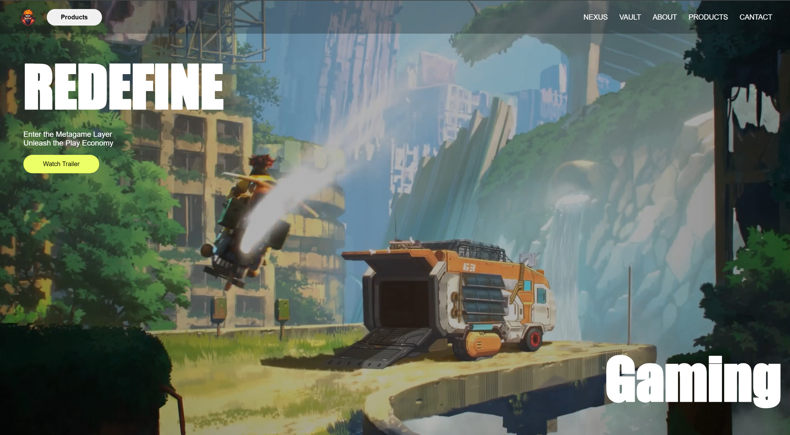

<a href="https://your-live-demo-link.com" target="_blank">
  
</a>

# RE-DEFINE

A modern futuristic gaming-inspired landing page built using HTML, CSS, and JavaScript.  
The project focuses on immersive UI design, smooth animations, responsive layouts, and visually engaging user interactions.

---

## Features

- Modern dark-themed gaming UI
- Responsive design for desktop and mobile
- Smooth scrolling experience
- Interactive hover animations
- Clean navigation layout
- Video-based visual sections
- Modern typography and visual aesthetics
- Optimized layout using Flexbox and CSS positioning

---

## Tech Stack

- HTML5
- CSS3
- JavaScript

---


## Preview

<a href="https://your-live-demo-link.com">
  
</a>

---

## Folder Structure

```bash
img/
videos/
index.html
style.css
app.js